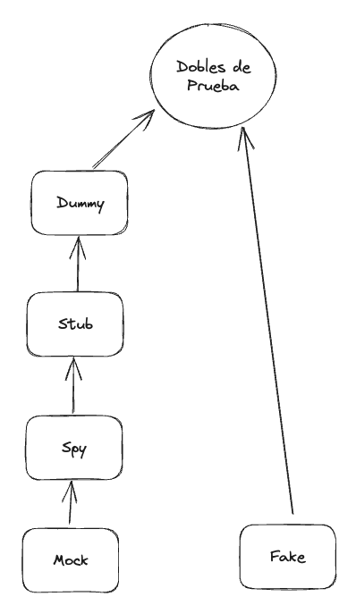

# Login Dialog
This a simple kata to practice test doubles. The goal is to test a LoginDialog that have an Authentication dependency.

The only rule is that **you can't use any mocking library**. You have to create your own test doubles.

You have one branch with an example with Mockito for you to understand how can you use test doubles in a real scenario.

Have fun!

## Double Types

- **Dummy**: It's a simple object that is passed around but never actually used. They are used to fill parameter lists.
- **Stub**: These objects provide canned answers to calls made during the test, usually not responding at all to anything outside what's programmed in for the test.
- **Spy**: These objects are similar that stubs but which store a log of the calls made to them which can be used in the test to verify the calls.
- **Strict Mock**: These objects are pre-programmed with expectations which form a specification of the calls they are expected to receive. They can throw an exception if they receive a call they don't expect and are checked during verification to ensure they got all the calls they were expecting.
- **Fake**: These objects have working implementations, but are usually simplified. For example, an in-memory database is a fake database.

This kata is used in my talk "El Arte de la Guerra…del testing: Dobladores de Pruebas", show in some events like:
- [CodeMotion Madrid 2024](https://conferences.codemotion.com/madrid2024/?utm_source=google_ads&utm_medium=paid_search&utm_campaign=CONFC_ESP_CODEMOTION_2024_MADRID&utm_content=esp&source=adv_google_search&gad_source=1)